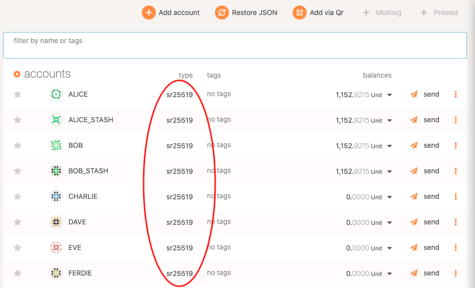
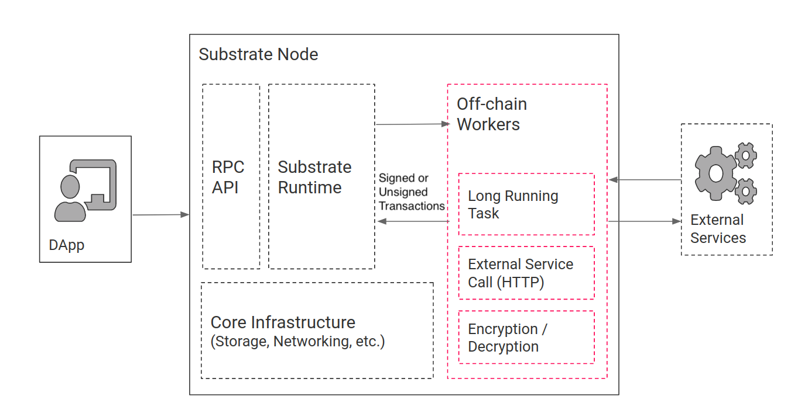

# Substrate 进阶课第四讲 - 链下工作机 (Off-chain Worker)

## Substrate 密码学

- 还是先过一下理论作铺垫
- Substrate 里其中两处用到密码学的地方是它的 **哈希方法** 和 **钥匙对的生成和使用**。

### 哈希键生成方法

```rust
pub OwnedKitties get(fn owned_kitties): map hasher(blake2_128_concat)
  (T::AccountId, Option<T::KittyIndex>) => Option<KittyLinkedItem<T>>;
```

- 这个 `blake2_128_concat` 是用作从后面的参数，指定怎样生成成键 (key) 的方法。它是一个密码学的生成方法。

这些方法需要有三个特质：


- 不容易从观察 **生成后结果** 倒推回 **生成前参数**。
- 如果 **生成前参数** 不一样，**生成后结果** 也不容易有重覆。但如果生成前是同一个参数，则要生成出一样的结果。
- **生成前参数** 如果有一丁点的改变，也会导致到 **生成后结果** 很大的改变。

而现在 `map` 键生成的方法支持:

1. `identity`: 对参数不作加密处理，直接拿作键值用。通常这是用在键参数不是用户控制的值上的。

2. `twox_64_concat`: 优点是非常的快 及支持 map 可遍历它的所有键，缺点是密码学上 "不是绝对安全"。

3. `blake2_128_concat`: 优点是密码学上相对安全，也支持该 map 可遍历它的所有键，缺点是需要一定计算量，相较 #2 较慢。

如果你们不知道选谁最合适，就选 #3 吧 😁

参考：

- https://substrate.dev/rustdocs/v2.0.0/frame_support/macro.decl_storage.html
- https://substrate.dev/docs/en/knowledgebase/advanced/cryptography
- https://wiki.polkadot.network/docs/en/learn-cryptography

### 钥匙对生成及签名法

- 在 Substrate, 所有钥匙对的实例都得实践 [`Pair` trait](https://substrate.dev/rustdocs/v2.0.0/sp_core/crypto/trait.Pair.html)

Substrate 支持三种钥匙生成及签名法

1. `ECDSA`: 基于 secp256k1 曲线的 `ECDSA` 签名算法

  - Bitcoin 和 Ethereum 都是用这钥匙生成及签名法
  - 参考 [secp256k1 曲线](https://en.bitcoin.it/wiki/Secp256k1)
  - 参考 [ECDSA 签名算法](https://en.wikipedia.org/wiki/Elliptic_Curve_Digital_Signature_Algorithm)

2. `Ed25519`: 基于 25519 曲线 (Curve25519) 的 `EdDSA` 签名算法

  - 参考 [25519 曲线](https://en.wikipedia.org/wiki/Curve25519)
  - 参考 [Ed25519](https://en.wikipedia.org/wiki/EdDSA#Ed25519)

3. `SR25519`: 基于受过 Ristretto 压缩法 (那个 `R`) 的 25519 曲线 的 Schnorrkel 签名算法 (那个 `S`)

  

  - 好处 1: 基于 `Ed25519` 再作了一些安全性的改良。把 25519 曲线的一些隐患解决掉。也是 Substrate 默认开帐号时用的方法
  - 好处 2: 有更好的 key 的 路径支持 (hierarchical deterministic key derivations)
  - 好处 3:  本身支持集成多签名
  - 参考 [Polkadot wiki: sr25519](https://wiki.polkadot.network/docs/en/learn-keys#what-is-sr25519-and-where-did-it-come-from)
  - 参考 [Polkadot wiki: keypairs](https://wiki.polkadot.network/docs/en/learn-cryptography#keypairs-and-signing)

## 链下工作机 off-chain worker (ocw)

### 什么是 ocw?



- 链上 runtime 逻辑有以下限制：

  - 所有计算不能占时太长，不然影响出块时间
  - 不能做没有绝对结果 (deterministic) 的操作。比如说发一个 http 请求。因为：1）有时可能会失败。2) 返回的结果不会时时都一样。
  - 最好不要占太多链上存储。因为每个数据都得重覆一篇存在每个节点上。

- 所以衍生出链下工作机 (off-chain worker), 简称 ocw.
- ocw 有以下特质：
  - 它在另一个（链下环境）运行，运行不影响出块
  - 链下工作机能读到链上存储的数据，但不能直接写到链上存储。
  - 它有一个专属的存储位置。存储在这里，只供这节点的所有链下工作机进程读写。
  - 同一时间可有多个链下工作机进程在跑着

    

- 它适合作什么？
  - 计算量大的工作
  - 没有绝对结果的操作
  - 有一些需要缓存数据的计算 (利用上 ocw 的单节点存储)

### 使用 ocw

以下开始进入编程环节，讲代码。大家可 git clone [ocw-demo](https://github.com/SubstrateCourse/ocw-demo). 跟着一起跑。我也是讲里面的内容。

首先从 `pallets/ocw-demo/src` 谈起。

触发 ocw，一個區塊生成 (稱作 block import) 有三個階段

- 區塊初始化 (block initialization)
- 跑鏈上邏輯
- 區塊最終化 (block finalization)

参考 [rustdoc](https://substrate.dev/rustdocs/v2.0.0/frame_system/enum.Phase.html)

你们定义的 pallet 都有 [OnInitialize](https://substrate.dev/rustdocs/v2.0.0/frame_support/traits/trait.OnInitialize.html), 及 [OnFinalize]((https://substrate.dev/rustdocs/v2.0.0/frame_support/traits/trait.OnFinalize.html)) 函数可供设定回调

完成一次區塊生成後，就會調用以下 ocw 入口。

```rust
fn offchain_worker(block_number: T::BlockNumber) {
  debug::info!("Entering off-chain worker");
  // ...
}
```

接下來我們可用三種交易方法把計算結果寫回鏈上：

  1. 签名交易
  2. 不签名交易
  3. 不签名交易但有签名数据

#### 签名交易

主要看代码里： `Self::offchain_signed_tx(block_number)`

1. 先从新定义一个用来签名的钥匙

    ```rust
    pub const KEY_TYPE: KeyTypeId = KeyTypeId(*b"demo");

    pub mod crypto {
      use crate::KEY_TYPE;
      use sp_runtime::app_crypto::{app_crypto, sr25519};
      // -- snip --
      app_crypto!(sr25519, KEY_TYPE);
    }
    ```

2. 你的 pallet Trait 也需要加多一个约束 `CreateSignedTransaction`:

    ```rust
    pub trait Trait: system::Trait + CreateSignedTransaction<Call<Self>> {
      /// The identifier type for an offchain worker.
      type AuthorityId: AppCrypto<Self::Public, Self::Signature>;
      /// The overarching dispatch call type.
      type Call: From<Call<Self>>;
      /// The overarching event type.
      type Event: From<Event<Self>> + Into<<Self as system::Trait>::Event>;
    }
    ```

3. 看看在 runtime 里是如何实现这个 pallet 的：

    `runtimes/src/lib.rs`

    ```rust
    impl ocw_demo::Trait for Runtime {
      type AuthorityId = ocw_demo::crypto::TestAuthId;
      type Call = Call;
      type Event = Event;
    }

    impl<LocalCall> frame_system::offchain::CreateSignedTransaction<LocalCall> for Runtime
    where
      Call: From<LocalCall>,
    {
      fn create_transaction<C: frame_system::offchain::AppCrypto<Self::Public, Self::Signature>>(
        call: Call,
        public: <Signature as sp_runtime::traits::Verify>::Signer,
        account: AccountId,
        index: Index,
      ) -> Option<(
        Call,
        <UncheckedExtrinsic as sp_runtime::traits::Extrinsic>::SignaturePayload,
      )> {
        let period = BlockHashCount::get() as u64;
        let current_block = System::block_number()
          .saturated_into::<u64>()
          .saturating_sub(1);
        let tip = 0;
        let extra: SignedExtra = (
          frame_system::CheckSpecVersion::<Runtime>::new(),
          frame_system::CheckTxVersion::<Runtime>::new(),
          frame_system::CheckGenesis::<Runtime>::new(),
          frame_system::CheckEra::<Runtime>::from(generic::Era::mortal(period, current_block)),
          frame_system::CheckNonce::<Runtime>::from(index),
          frame_system::CheckWeight::<Runtime>::new(),
          pallet_transaction_payment::ChargeTransactionPayment::<Runtime>::from(tip),
        );

        #[cfg_attr(not(feature = "std"), allow(unused_variables))]
        let raw_payload = SignedPayload::new(call, extra)
          .map_err(|e| {
            debug::native::warn!("SignedPayload error: {:?}", e);
          })
          .ok()?;

        let signature = raw_payload.using_encoded(|payload| C::sign(payload, public))?;

        let address = account;
        let (call, extra, _) = raw_payload.deconstruct();
        Some((call, (address, signature, extra)))
      }
    }

    // 还有这个 SignedExtra 是在下面定义的

    /// The SignedExtension to the basic transaction logic.
    pub type SignedExtra = (
      frame_system::CheckSpecVersion<Runtime>,
      frame_system::CheckTxVersion<Runtime>,
      frame_system::CheckGenesis<Runtime>,
      frame_system::CheckEra<Runtime>,
      frame_system::CheckNonce<Runtime>,
      frame_system::CheckWeight<Runtime>,
      pallet_transaction_payment::ChargeTransactionPayment<Runtime>,
    );
    ```

4. 接下来看 `fn offchain_signed_tx` 内的函数

    ```rust
    fn offchain_signed_tx(block_number: T::BlockNumber) -> Result<(), Error<T>> {
      // We retrieve a signer and check if it is valid.
      //   Since this pallet only has one key in the keystore. We use `any_account()1 to
      //   retrieve it. If there are multiple keys and we want to pinpoint it, `with_filter()` can be chained,
      //   ref: https://substrate.dev/rustdocs/v2.0.0/frame_system/offchain/struct.Signer.html
      let signer = Signer::<T, T::AuthorityId>::any_account();

      // Translating the current block number to number and submit it on-chain
      let number: u64 = block_number.try_into().unwrap_or(0) as u64;

      // `result` is in the type of `Option<(Account<T>, Result<(), ()>)>`. It is:
      //   - `None`: no account is available for sending transaction
      //   - `Some((account, Ok(())))`: transaction is successfully sent
      //   - `Some((account, Err(())))`: error occured when sending the transaction
      let result = signer.send_signed_transaction(|_acct|
        // This is the on-chain function
        Call::submit_number_signed(number)
      );

      // Display error if the signed tx fails.
      if let Some((acc, res)) = result {
        if res.is_err() {
          debug::error!("failure: offchain_signed_tx: tx sent: {:?}", acc.id);
          return Err(<Error<T>>::OffchainSignedTxError);
        }
        // Transaction is sent successfully
        return Ok(());
      }

      // The case of `None`: no account is available for sending
      debug::error!("No local account available");
      Err(<Error<T>>::NoLocalAcctForSigning)
    }
    ```

5. 然后就是当下一次区块生成的时候，你就看到 `submit_number_signed()` 被呼叫到。一个数字也加到去 `Number`
这个 `Vec` 里。

#### 不签名交易

#### 不签名但具签名信息的交易

#### 发 HTTP 请求

#### 解析 JSON

#### ocw 自己链下的独立存储

## Pallet 讲解: `pallet-im-online`

- 首先，打开 [rustdoc 文档](`https://substrate.dev/rustdocs/v2.0.0/pallet_im_online/index.html`)

## 作业

这是一个有趣的作业，我们一起尝试用 off-chain worker 取得 DOT (或你所选的加密币) 的价格，然后用不签名但具签名信息的交易把得到的 DOT 价格资讯传回到链上。

- git clone [这个代码](TODO) 库作为基础。尝试编译，确定可编译通过。
- 过一编代码结构，要做的地方
